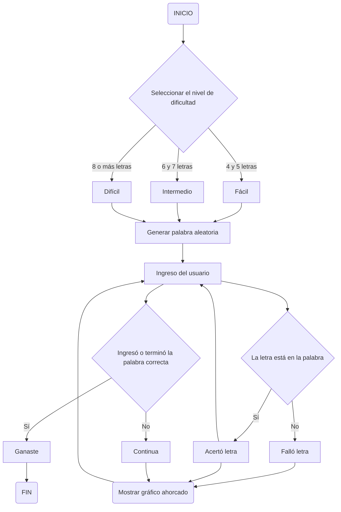

# Proyecto-final

Integrantes del equipo:
- Andrés Camilo Bustamante Guzmán
- Jhonatan Esteban Forero Velásquez
- Jaime Eduardo Ríos Villegas
  
**Ahorcado**

planteamiento previo

1. creacion de la base de datos
   para empezar se acuede a buscar palabras en español con el fin de trabajarlas y traducirlas a otros idiomas (ingles y frances), en este caso se trabajo a partir de 1102 palabras las cuales despues de tratarlas se modificaron de tal manera que se adaptaran a los otros idiomas implementados.

Ejemplo de las palabras:

   
2. planteamiento del nivel del juego

   En este punto, a partir de la clasificacion de las palabras del punto anterior y tomando en cuenta la decision o lo que quiere el jugador se podra elegir entre tres niveles regidos por la extension de las palabras (palabras de 1-5, de 5-8 y de 8 en adelante)

3. inicio del juego
   a partir de la lista de palabras y el uso de la funcion random, se va a seleccionar una palabra oculta con la que el jugador va a interactuar

   "random.randint(0, len(lista_palabras) - 1))"
   
4. evaluacion palabra o letra
   posteriormente se crea un ciclo con el cual se evaluara la pertenencia de las letras a la palabra oculta, teneiendo en cuenta la pertenencia de cada letra a la palabra, dando como resultado el reemplzo de la letra si es True o dejar el espcio sin alterar si es false

5. entorno 
   para el entorno se tiene en cuenta dos partes: la primera corresponde a el tablero, donde se mostraran las palabras acertadas y el segundo es el  dibujo de hagman, para este a partir de la delimiticacion de un numero de intentis disponibles se dispondra el desarrollo del dibujo de hagman, el cual va evolucionando o completandose a parir de los intentos erroneos.

6.  Requerimientos:
  el programa en si no necesita mucho ya que sus palabras ya estan apropiadas como un string, lo que si es necesario es instalar pyfiglet para poder evidenciar la victoria de una manera mas satisfactoria.

  
Flujograma del programa

