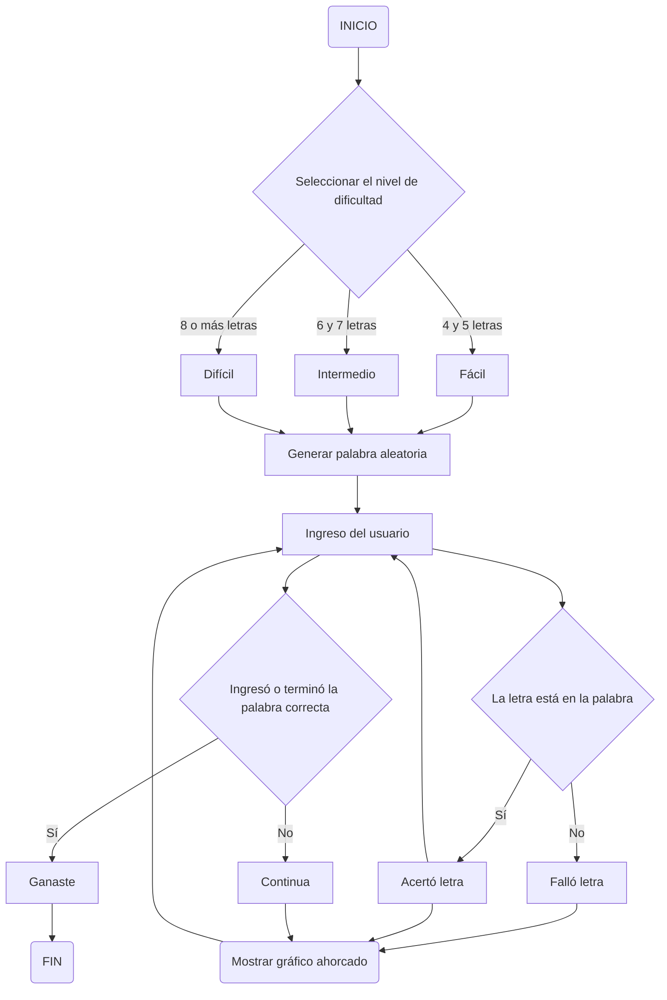

# Proyecto-final

Integrantes del equipo:
- Andrés Camilo Bustamante Guzmán
- Jhonatan Esteban Forero Velásquez
- Jaime Eduardo Ríos Villegas
  
**Ahorcado**

planteamiento previo

1. creacion de la base de datos
   para esta parte se crea un archivo de texto con las palabras  que van a estar presentes en el juego, claro esta que se tienen que clasificar con el fin de generar los tres niveles de dificultad

   
2. planteamiento del nivel del juego
    En este punto se a partir de la clasificacion de las palabras del punto anterior y tomando en cuenta la decicion o lo que quiere el jugador se podra elegir entre tres niveles regidos por la extension de las palabras

3. inicio del juego
   a partir de la lista de palabras y el uso de la funcion random, se va a seleccionar una palabra oculta con la que el jugador va a interactuar

   "palabra_aleatoria=random.choice(listadepalabras)"
   
4. evaluacion palabra o letra
   posteriormente se crea un ciclo con el cual se evaluara la pertenencia de las letras a la palabra oculta, teneiendo en cuenta dos condiciones primero como es la entrada ya que si es una letra se compara la pertenencia a la palabra y si es palabra e evalua que sea igual; la segunda condicion radica en la no repeticion de la letra 

5. entorno 
   para el entorno se tiene en cuenta dos partes: la primera corresponde a el tablero, donde se mostraran las palabras acertadas y el segundo es el  dibujo de hagman, para este a partir de la delimiticacion de un numero de intentis disponibles se dispondra el desarrollo del dibujo de hagman, el cual va evolucionando o completandose a parir de los intentos erroneos.

Flujograma del programa

